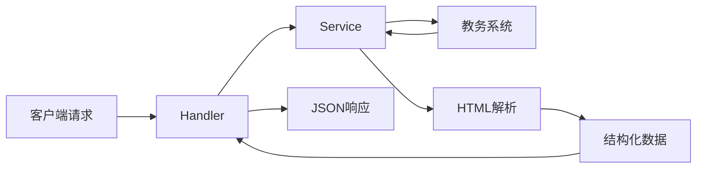

# 设计文档

## 概述

[功能的高层描述及其在整体系统中的位置]

## 技术规范对齐

### 技术标准 (tech.md)

[设计如何遵循已文档化的技术模式和标准]

### 项目结构 (structure.md)

[实现如何遵循项目组织约定]

## 代码复用分析

### 现有组件复用

- **common/response**: 统一响应封装
- **common/request**: HTTP 请求工具
- **middleware/auth**: 鉴权中间件
- **[其他可复用组件]**: [复用方式]

### 集成点

- **教务系统**: [如何与教务系统交互]
- **现有 Service**: [如何与现有服务集成]

## 架构设计

### 分层结构

```
┌─────────────────────────────────┐
│     api/v1/[feature].go         │  ← Handler 层
│   参数绑定 → 调用Service → 响应   │
└─────────────────────────────────┘
              │
              ▼
┌─────────────────────────────────┐
│    service/[feature].go         │  ← Service 层
│  HTTP请求 + 爬虫 + HTML解析       │
└─────────────────────────────────┘
              │
              ▼
┌─────────────────────────────────┐
│     model/[feature].go          │  ← Model 层
│   结构体 + 请求参数 + 响应结构     │
└─────────────────────────────────┘
```

### 数据流



## 组件设计

### Handler 层 (api/v1/[feature].go)

- **职责**: 参数绑定、调用 Service、构造响应
- **接口**: HTTP 路由处理函数
- **依赖**: service 包、model 包、common/response 包

### Service 层 (service/[feature].go)

- **职责**: 业务逻辑、HTTP 请求、HTML 解析
- **接口**: 导出函数供 Handler 调用
- **依赖**: model 包、common/request 包、goquery

### Model 层 (model/[feature].go)

- **职责**: 定义数据结构
- **接口**: 请求结构体、响应结构体
- **依赖**: 无（纯数据结构）

## 数据模型

### 请求模型

```go
type [Feature]Request struct {
    Field1 string `json:"field1" binding:"required"`
    Field2 string `json:"field2"`
}
```

### 响应模型

```go
type [Feature]Info struct {
    Field1 string `json:"field1"`
    Field2 string `json:"field2"`
}
```

## 错误处理

### 哨兵错误定义

```go
var (
    Err[Feature]NotFound = errors.New("[feature]_not_found")
    Err[Feature]Failed   = errors.New("[feature]_failed")
)
```

### 错误场景

| 场景 | 错误类型 | 处理方式 | 用户提示 |
|------|---------|---------|---------|
| Cookie 过期 | ErrCookieExpired | 返回 401 | "登录已过期，请重新登录" |
| 参数错误 | 绑定失败 | 返回 400 | "参数错误" |
| 教务系统异常 | 请求失败 | 返回 500 | "服务暂时不可用" |

## 测试策略

### 手动测试

- [需要测试的 API 接口列表]
- [需要验证的边界条件]

### 自动化测试（如适用）

- [单元测试覆盖的函数]
- [集成测试场景]

## 前端页面（如适用）

### 页面位置

`web/[feature].html`

### 页面功能

- [页面提供的功能]
- [与后端 API 的交互方式]
