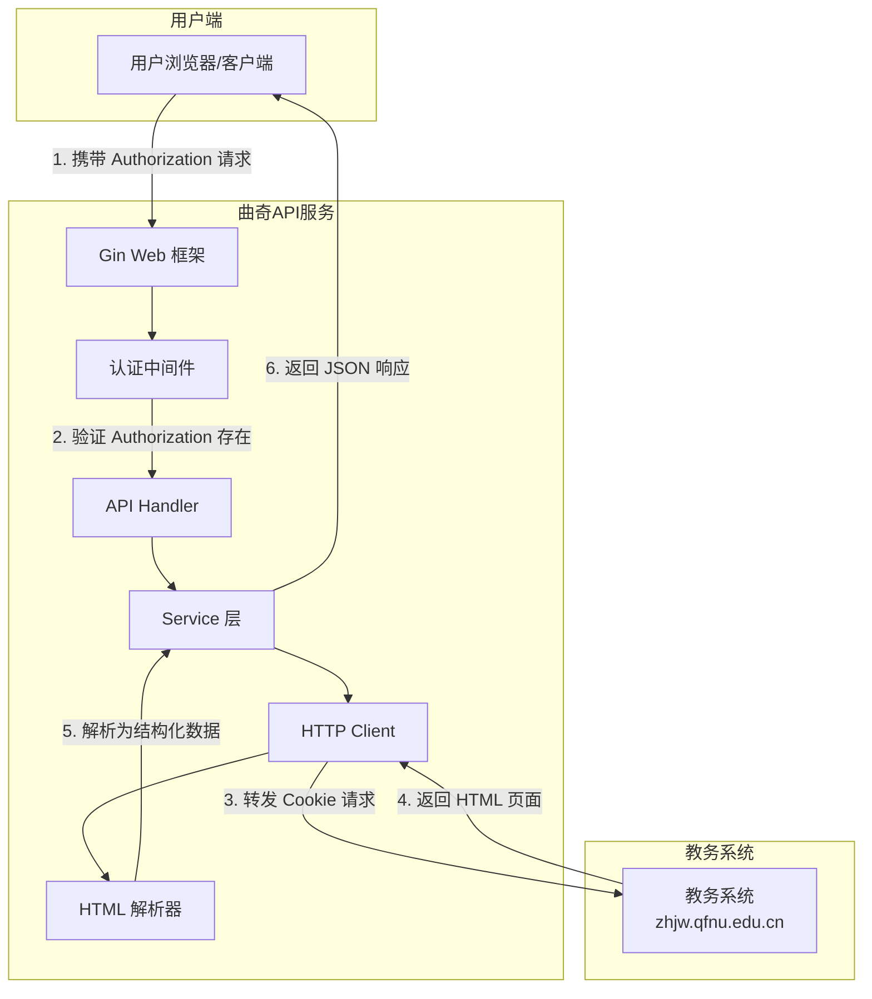
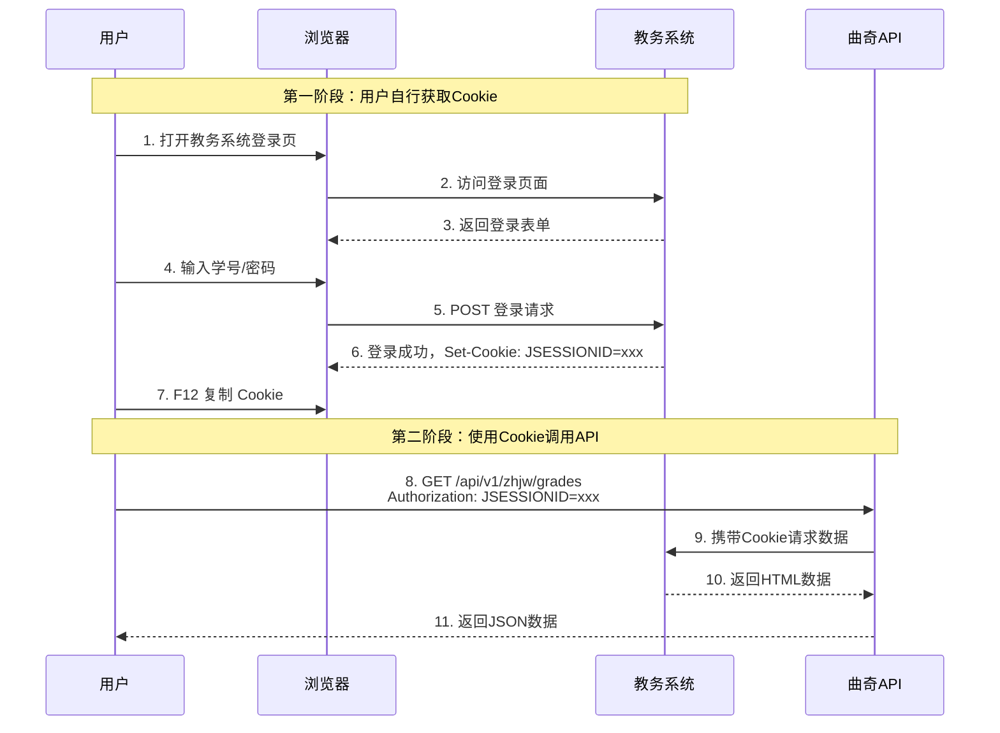
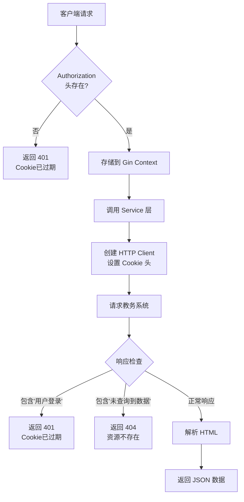
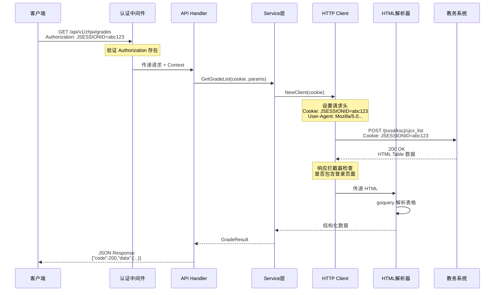
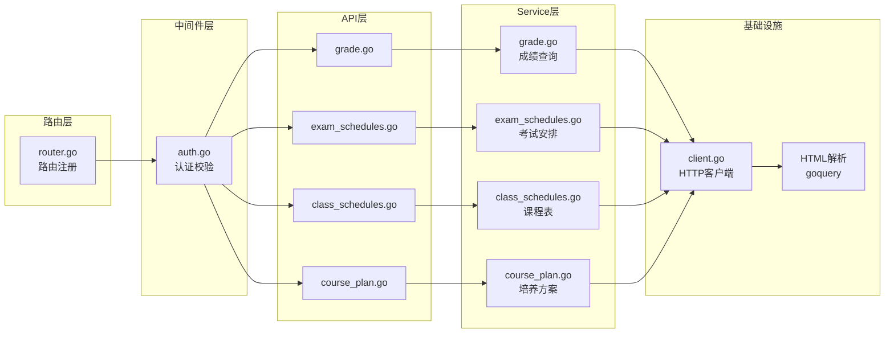
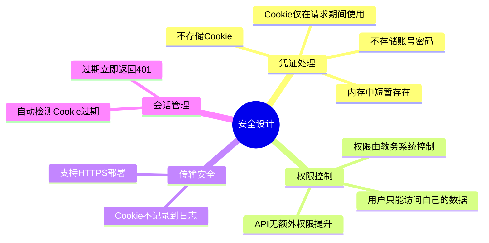
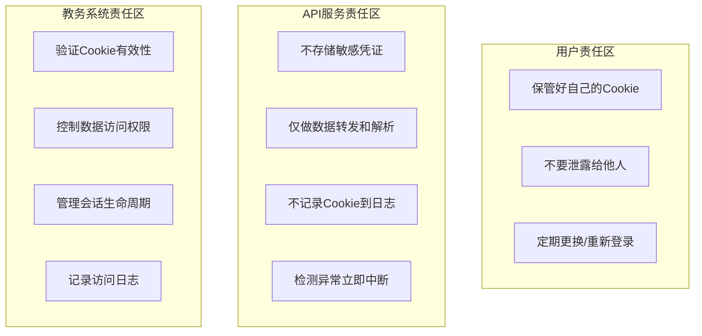
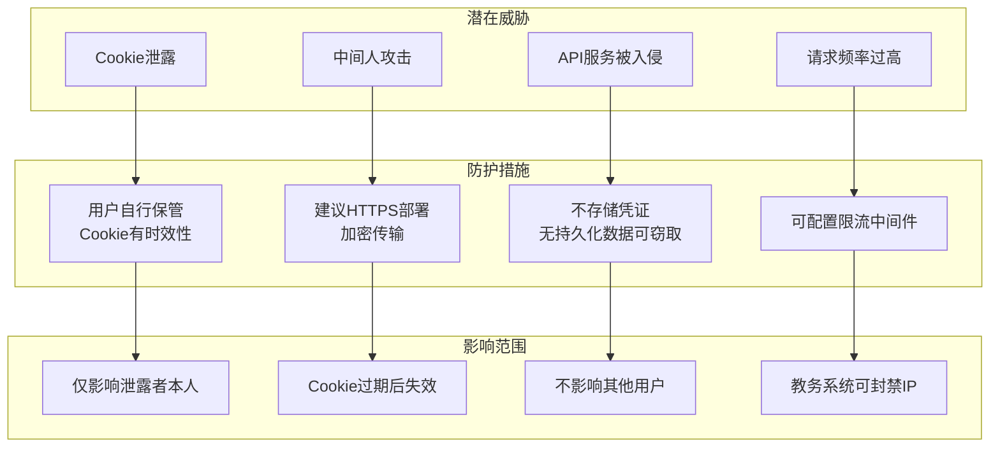
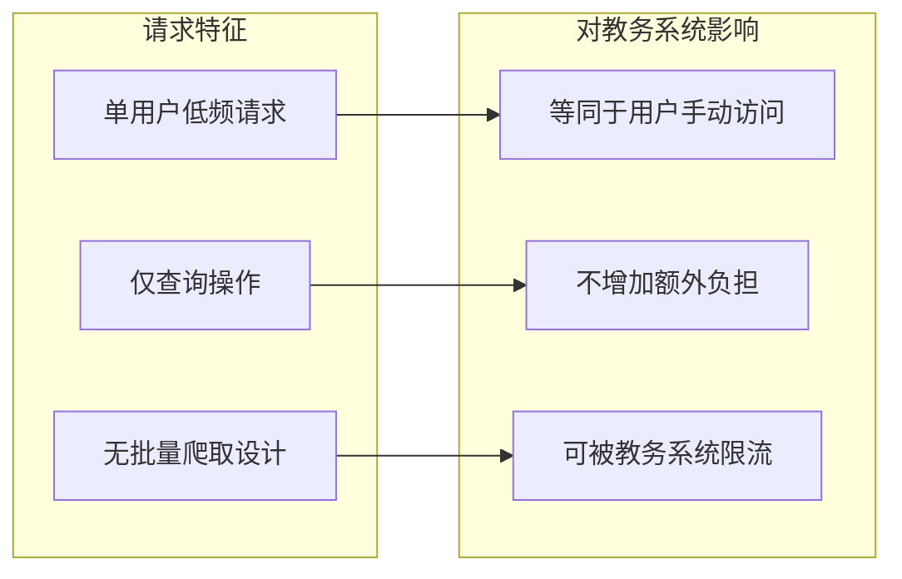
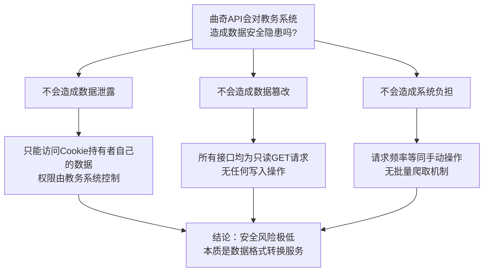

# 曲奇API 架构与安全分析

本文档详细说明曲奇API服务如何与教务系统进行交互，以及相关的安全机制分析。

---

## 一、系统架构概述

曲奇API是一个**代理/转发型**服务，它不直接存储用户的账号密码，而是通过用户提供的会话凭证（Cookie）代为访问教务系统，并将返回的HTML数据解析为结构化的JSON格式。



---

## 二、认证流程详解

### 2.1 Cookie 获取流程（用户侧）

用户需要**自行登录教务系统**获取有效的会话Cookie，曲奇API不参与登录过程。



### 2.2 请求处理流程



---

## 三、数据流向分析

### 3.1 完整请求链路



### 3.2 核心组件职责



---

## 四、安全机制分析

### 4.1 安全设计要点



### 4.2 安全边界划分



### 4.3 威胁模型分析



---

## 五、对教务系统的影响评估

### 5.1 数据安全影响

| 风险点 | 风险等级 | 说明 |
|--------|----------|------|
| 数据泄露 | **低** | API仅能获取用户自己的数据，不能越权访问他人数据 |
| 数据篡改 | **无** | API为只读操作，不提供任何写入/修改接口 |
| 数据完整性 | **无影响** | 不对教务系统数据进行任何修改 |
| 凭证安全 | **低** | 不存储密码，Cookie有时效性且由用户自行管理 |

### 5.2 系统负载影响



### 5.3 安全结论



---

## 六、技术实现细节

### 6.1 Cookie 转发机制

```go
// services/zhjw/client.go
func NewClient(Authorization string) *resty.Client {
    client := resty.New()
    client.SetBaseURL("http://zhjw.qfnu.edu.cn")
    client.SetHeader("Cookie", Authorization)  // 关键：Cookie转发
    // ...
    return client
}
```

### 6.2 会话失效检测

```go
// services/zhjw/client.go - 响应拦截器
client.OnAfterResponse(func(c *resty.Client, resp *resty.Response) error {
    body := resp.String()
    // 检测是否被重定向到登录页
    if strings.Contains(body, "用户登录") {
        return ErrCookieExpired
    }
    return nil
})
```

### 6.3 错误码映射

| API 错误码 | HTTP 状态 | 含义 | 教务系统状态 |
|-----------|----------|------|-------------|
| 200 | 200 | 成功 | 正常响应 |
| 401 | 401 | Cookie已过期 | 重定向到登录页 |
| 404 | 200 | 无数据 | 返回"未查询到数据" |
| 502 | 502 | 教务系统不可用 | 连接超时/错误 |

---

## 七、部署安全建议

1. **启用 HTTPS**：确保客户端与API服务之间的通信加密
2. **配置限流**：防止单用户高频请求对教务系统造成压力
3. **日志脱敏**：确保日志中不记录 Cookie 等敏感信息
4. **定期审计**：检查是否有异常的请求模式

---

## 八、总结

曲奇API采用**透传代理**模式，具有以下安全特性：

- **最小权限原则**：仅转发用户自己的Cookie，无法越权
- **无状态设计**：不存储任何用户凭证，无持久化攻击面
- **只读操作**：所有接口均为查询，不修改任何数据
- **会话隔离**：每个请求独立，Cookie仅在单次请求中使用

**对教务系统的影响**：等同于用户通过浏览器手动访问，不会造成数据安全隐患。
